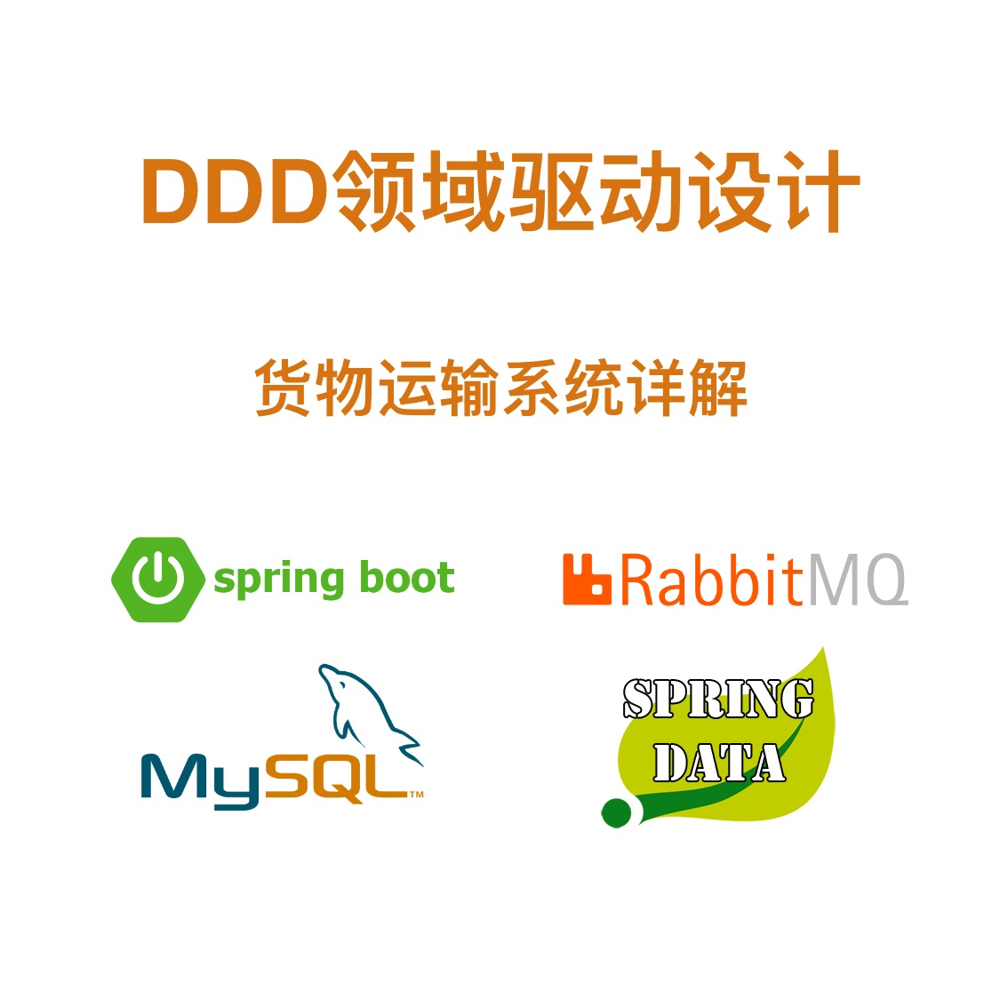

# 专栏简介
本技术专栏以货物运输系统（Cargo Tracker application ）为示例，讲解领域驱动设计的建模过程，以及代码实现细节。 

https://learning.snssdk.com/feoffline/toutiao_wallet_bundles/toutiao_learning_wap/online/album_detail.html?content_id=6936902759186694407

# 专栏介绍
从业务出发、面向业务变化是我们现代架构设计成功的关键。架构设计的核心是保证面对业务变化时，我们能够有足够快的响应能力。

那么，如何才能打造高响应力架构呢？

领域驱动设计方法DDD（Domain Driven Design）为我们提供了很好的切入点。DDD 即领域驱动设计是思考问题的方法论，用于对实际问题建模，它以一种领域专家、设计人员、开发人员都能理解的通用语言作为相互交流的工具，然后将这些概念设计成一个领域模型。由领域模型驱动软件设计，用代码来实现该领域模型。所以，DDD 的核心是建立正确的领域模型。

本技术专栏以货物运输系统（Cargo Tracker application ）为示例，讲解领域驱动设计的建模过程，以及代码实现细节。

# 专栏大纲
本技术专栏以货物运输系统（Cargo Tracker application ）为示例，讲解领域驱动设计的建模过程，以及代码实现细节。
货物运输系统是DDD（领域驱动设计）的经典案例：基于Spring Boot微服务框架、DDD领域驱动设计思想、RabbitMQ和Spring Cloud Stream、CQRS架构（Command Query Responsibility Segregation，命令和查询职责分离）等等。

主要内容如下：
* 基于DDD领域驱动设计和Spring Boot实现的货物运输系统
* 搭建MySQL和RabbitMQ运行环境：启动bookingms微服务应用
* 基于Spring Boot微服务框架的限界上下文：包结构分类
* 货物运输微服务应用整体解决方案概览
* 领域模型中聚合和聚合根的实现
* 领域模型中实体对象和值对象的实现
* 领域模型中的方法
* 命令和查询
* 领域事件
* 领域服务

# 适合人群
本专栏主要面向有一定Java项目开发实践经验的软件开发人员、架构师、软件专家等等。或者希望学习领域驱动设计思想的相关人员。

# 学习收获
通过学习DDD领域驱动设计思想，并结合实际的货物运输系统应用项目和源代码，对DDD建模过程以及代码落地获得更加深入的理解。

